# Preface
This repository is created for the final submission of 
the course `high performance computing fluid dynamics with python`
at the University of Freiburg 2021 Summer semester.

The following figures is the visualization of the velocity field of sliding lid.
<table>
    <tr>
        <td style="text-align:center;vertical-align:middle;">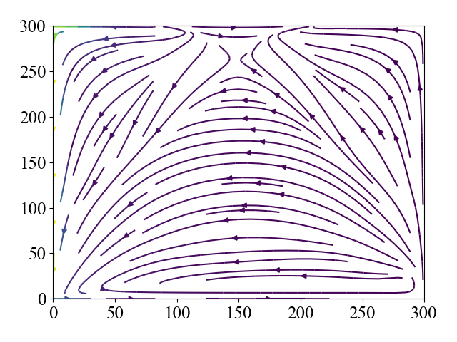t = 1000</td>
        <td style="text-align:center;vertical-align:middle;">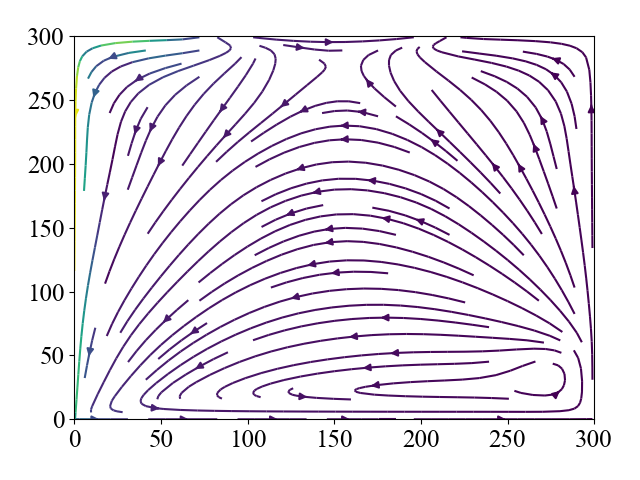t = 2000</td>
        <td style="text-align:center;vertical-align:middle;">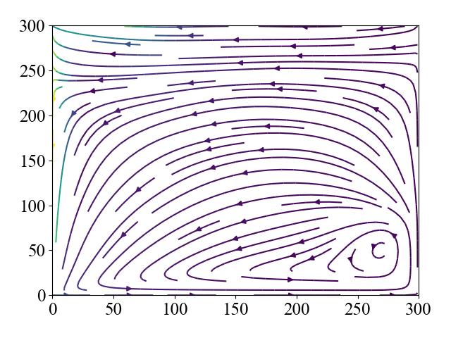t = 3000</td>
        <td style="text-align:center;vertical-align:middle;">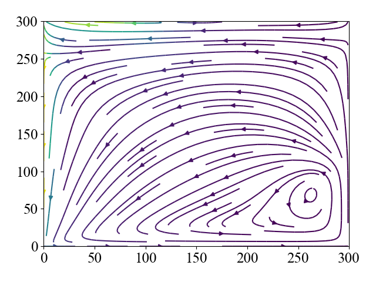t = 4000</td>
    </tr>
    <tr>
        <td style="text-align:center;vertical-align:middle;">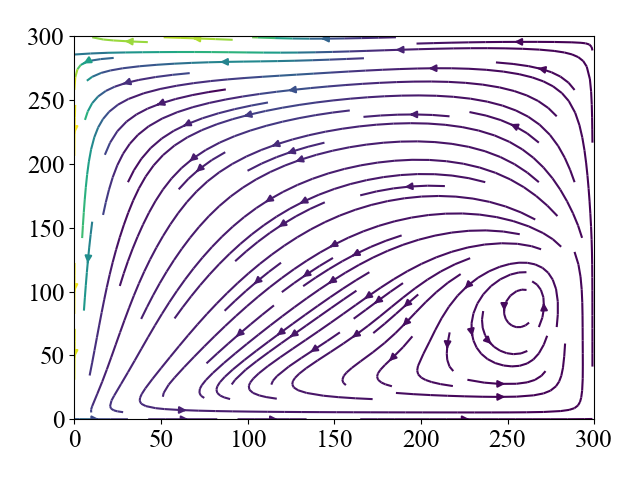t = 5000</td>
        <td style="text-align:center;vertical-align:middle;">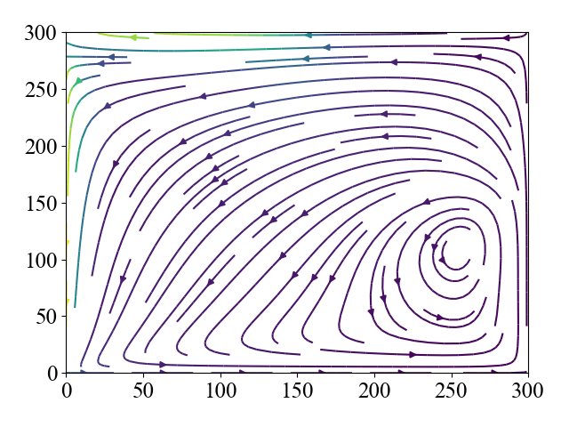t = 6000</td>
        <td style="text-align:center;vertical-align:middle;">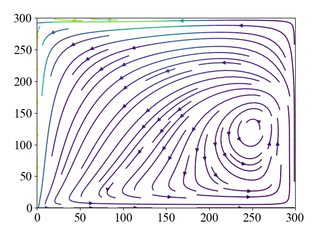t = 7000</td>
        <td style="text-align:center;vertical-align:middle;">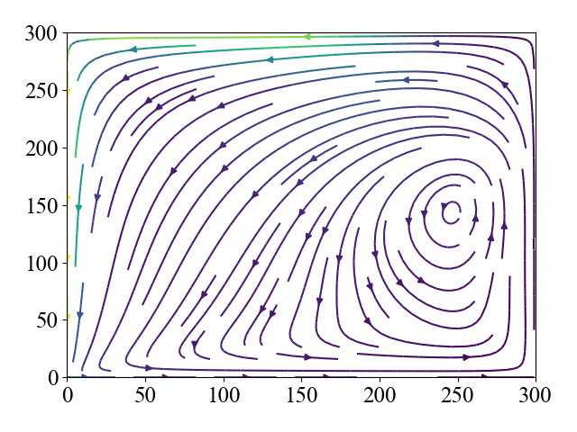t = 8000</td>
    </tr>
    <tr>
        <td style="text-align:center;vertical-align:middle;">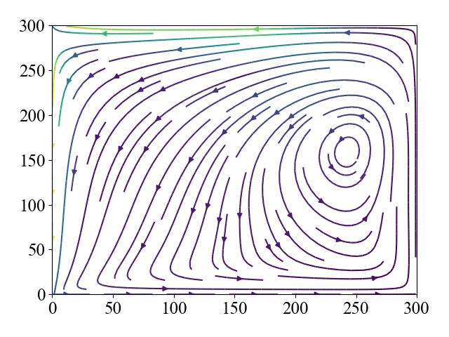t = 9000</td>
        <td style="text-align:center;vertical-align:middle;">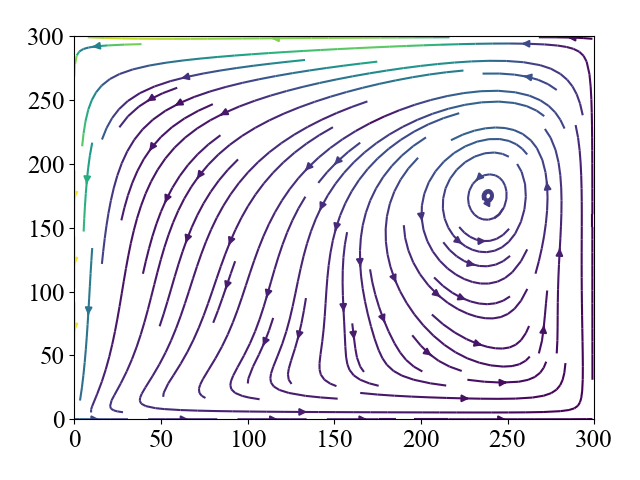t = 10000</td>
        <td style="text-align:center;vertical-align:middle;">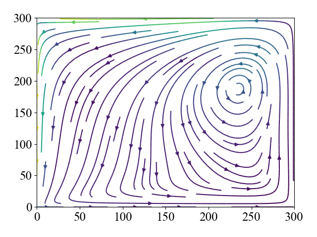t = 11000</td>
        <td style="text-align:center;vertical-align:middle;">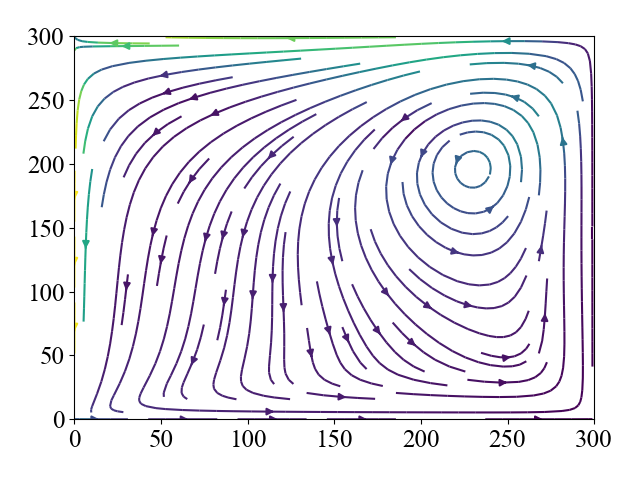t = 12000</td>
    </tr>
    <tr>
        <td style="text-align:center;vertical-align:middle;">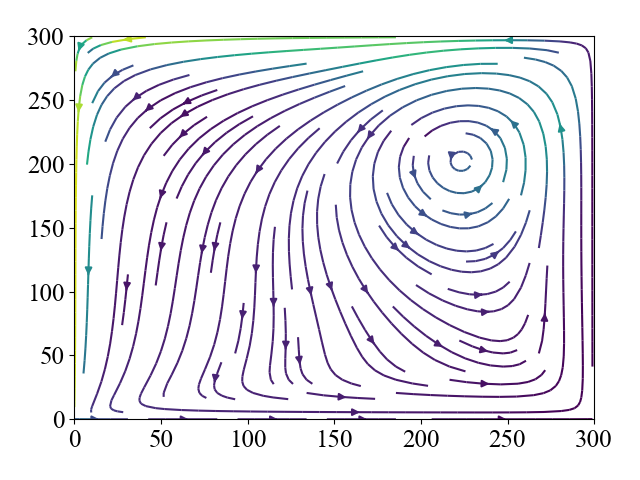t = 13000</td>
        <td style="text-align:center;vertical-align:middle;">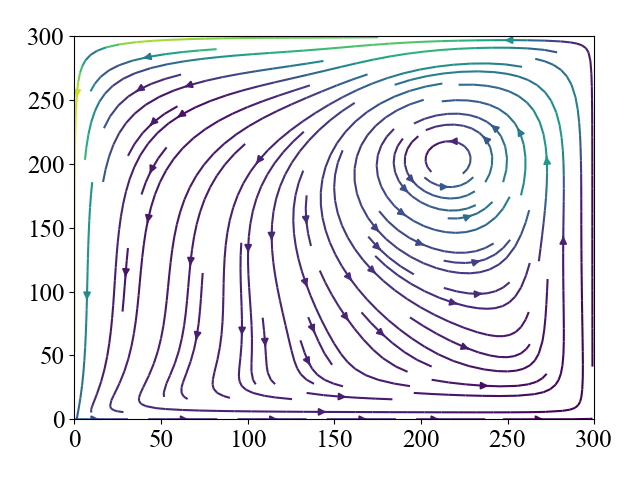t = 14000</td>
        <td style="text-align:center;vertical-align:middle;">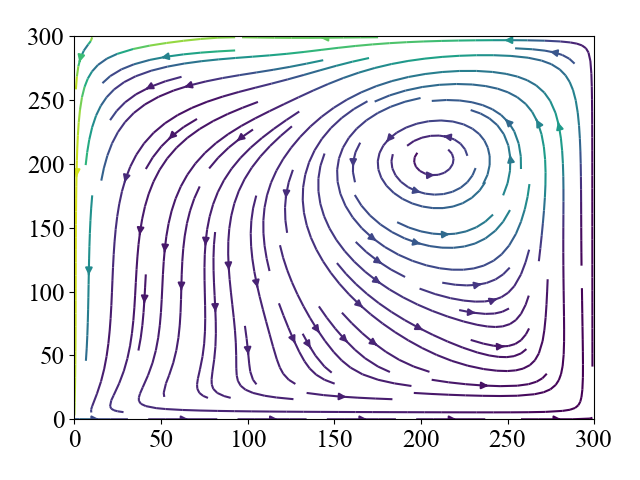t = 15000</td>
        <td style="text-align:center;vertical-align:middle;">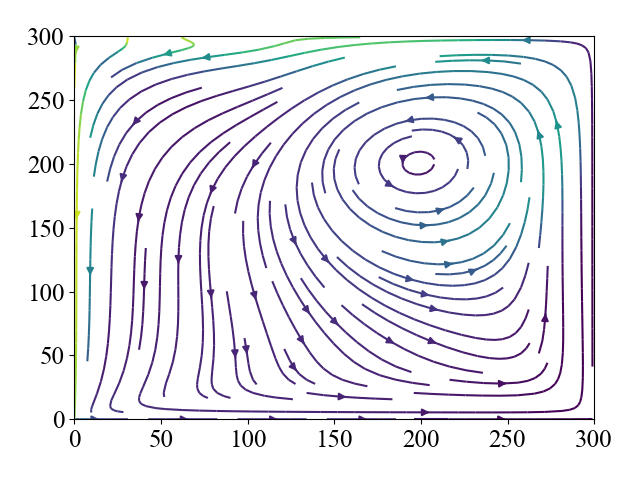t = 16000</td>
    </tr>
</table>


# Setup

First, setup the environment using the following commands:
```
$ conda create -n hpc-fluid-dyn -c conda-forge python=3.6
$ conda activate hpc-fluid-dyn
$ pip install -r requirements.txt
```

# Reproduce the experiments

```
# The experiments except the scaling test
$ ./run_local.sh

# The scaling test (computations that require only 1 node)
$ ./run_on_cluster_manually.sh

# The scaling test (computations that require more than 1 node)
$ ./run_on_cluster.sh
```

Note that `./run_local.sh` includes the sliding lid simulation with the lattice shape of `300 x 300`
and you might want to avoid these computations.

# Structure

This repository is composed of three main parts:
1. Lattice Boltzmann method (`src/simulation_attributes/lattice_boltzmann_method.py`)
2. Boundary handling (`src/simulation_attributes/boundary_handling.py`)
3. Communication among threads (`src/utils/parallel_computation.py`)
The codes are securely maintained by the test codes in `test/`.

Furthermore, the visualizations and experiments are supported by `src/utils/visualization.py` and `src/experiments.py`.
All the codes are based on the codes created during the progress of milestones provided by lecturers.
However, since the final goal is to yield the results specified by the course, each milestone might not work because of the modifications that came later.
