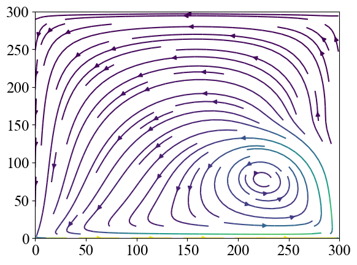
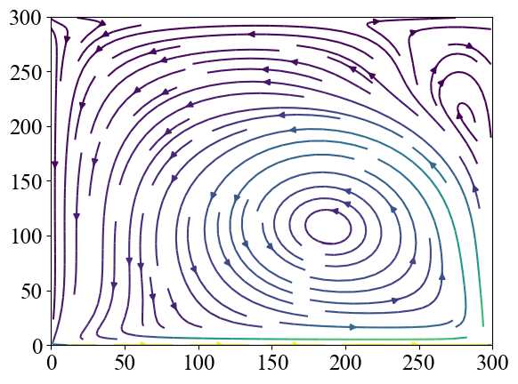
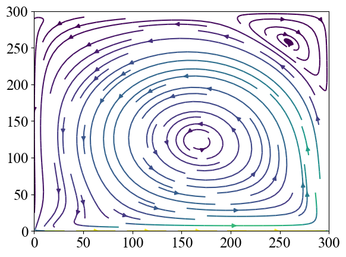
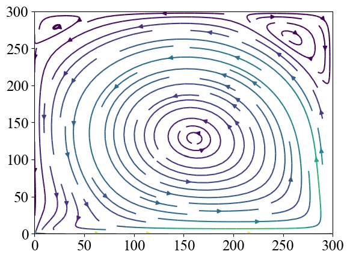
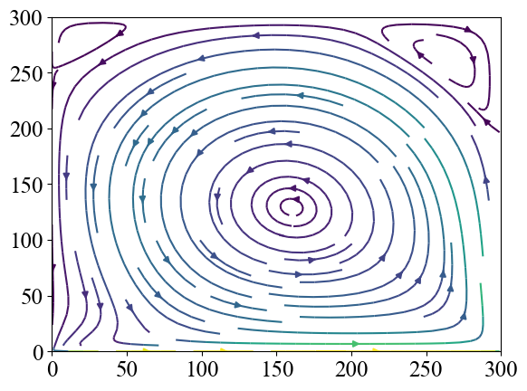
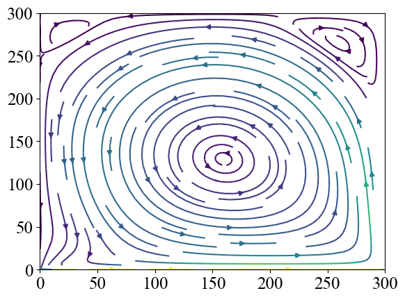
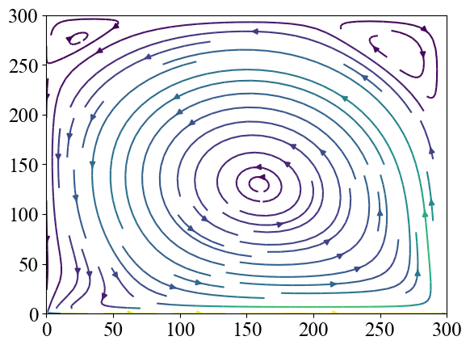
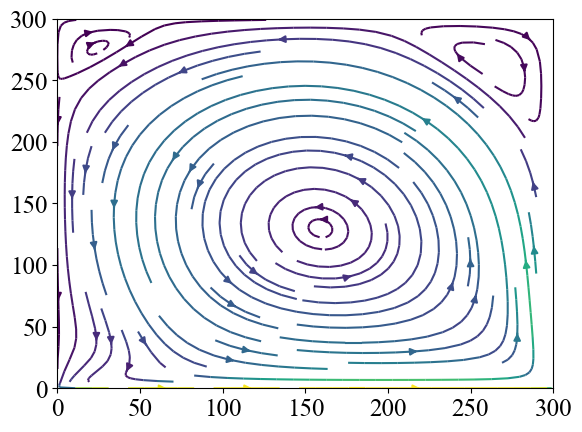

# Lid-driven cavity using lattice boltzmann method
<p align="middle">
    
</p>

# Preface
This repository is created for the final submission of 
the course `high performance computing fluid dynamics with python`
at the University of Freiburg 2021 Summer semester.

The following figures are the visualization of the velocity field of sliding lid at every 4000 time steps from 1000 to 45000 time steps.
<table>
    <tr>
        <td></td>
        <td></td>
        <td></td>
        <td></td>
    </tr>
    <tr>
        <td></td>
        <td></td>
        <td></td>
        <td></td>
    </tr>
    <tr>
        <td></td>
        <td></td>
        <td></td>
        <td></td>
    </tr>
    <tr>
        <td></td>
        <td></td>
        <td></td>
        <td></td>
    </tr>
</table>


# Setup

First, setup the environment using the following commands:
```
$ conda create -n hpc-fluid -c conda-forge python=3.6
$ conda activate hpc-fluid
$ pip install -r requirements.txt
```

# Reproduce the experiments

```
### Run local ###
# The experiments except the scaling test
$ ./run_scripts/run_local.sh

### Run on BWUniCluster ###
# The scaling test (computations that require only 1 node)
$ ./run_scripts/run_on_cluster_manually.sh

# The scaling test (computations that require more than 1 node)
$ ./run_scripts/submit_scaling_test.sh
```

Note that `./run_scripts/run_local.sh` includes the sliding lid simulation with the lattice shape of `300 x 300`
and you might want to avoid these computations.

# Options for running experiments
```
-E (str): The experiment name
    [Options]
    cf: The time evolution of the velocity in the Couette flow,
    pf: The time evolution of the velocity in the Poiseuille flow
    se: The time evolution of physical quantities given an initial sinusoidal
    sv: The measurement of viscosity by sinusoidal settings versus the analytical viscosity
    ss: The sliding lid (or lid-driven cavity) experiment by the serial implementation
    sm: The sliding lid (or lid-driven cavity) experiment by the parallel implementation
-T (int): Total time steps in the experiments
-X (int): The lattice grid size in the x-direction
-Y (int): The lattice grid size in the y-direction
--omega (float): The relaxation factor
--visc (float): The viscosity of fluid (--omega and --visc cannot co-exist)
-I (float): The density factor at the inlet
-O (float): The density factor at the outlet
-W, --wall_vel (float): The velocity of the wall along the x-axis
--eps (float): The amplitude of swinging in sinusoidal
--rho (float): The offset of the density in sinusoidal or rho_0
--mode (Literal[v, d]): Either sinusoidal [v]elocity or [d]ensity
--scaling (Literal[True, False]): Whether performing scaling test
--save (Literal[True, False]): Whether saving data or not
```

# Structure

This repository is composed of three main parts:
1. Lattice Boltzmann method (`src/simulation_attributes/lattice_boltzmann_method.py`)
2. Boundary handling (`src/simulation_attributes/boundary_handling.py`)
3. Communication among threads (`src/utils/parallel_computation.py`)
The codes are securely maintained by the test codes in `test/`.

Furthermore, the visualizations and experiments are supported by `src/utils/visualization.py` and `src/experiments.py`.
All the codes are based on the codes created during the progress of milestones provided by lecturers.
However, since the final goal is to yield the results specified by the course, each milestone might not work because of the modifications that came later.
